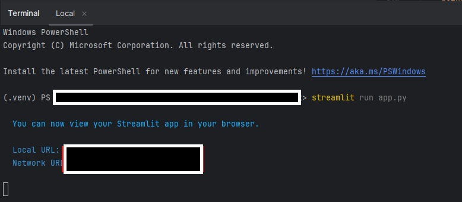
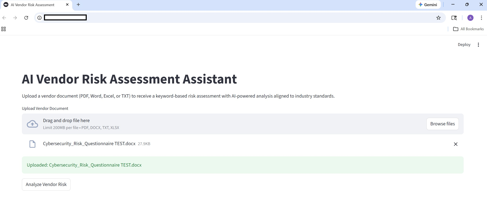
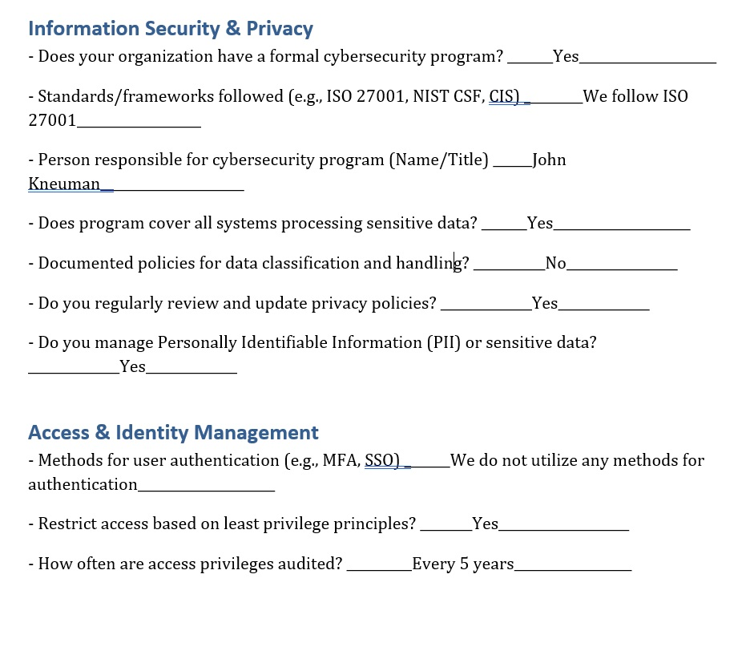
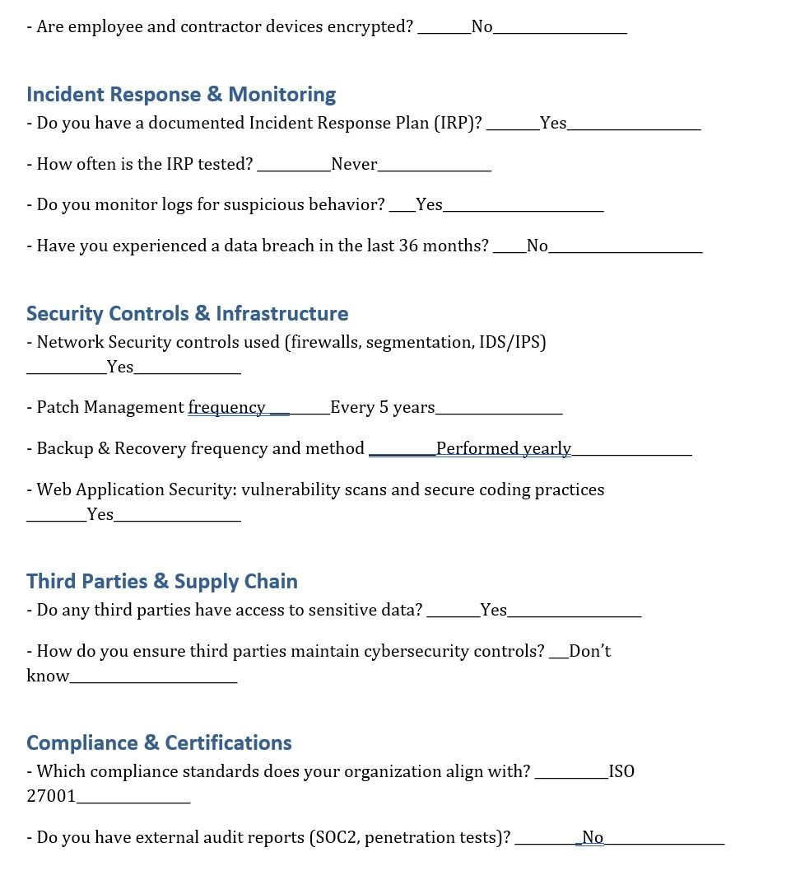
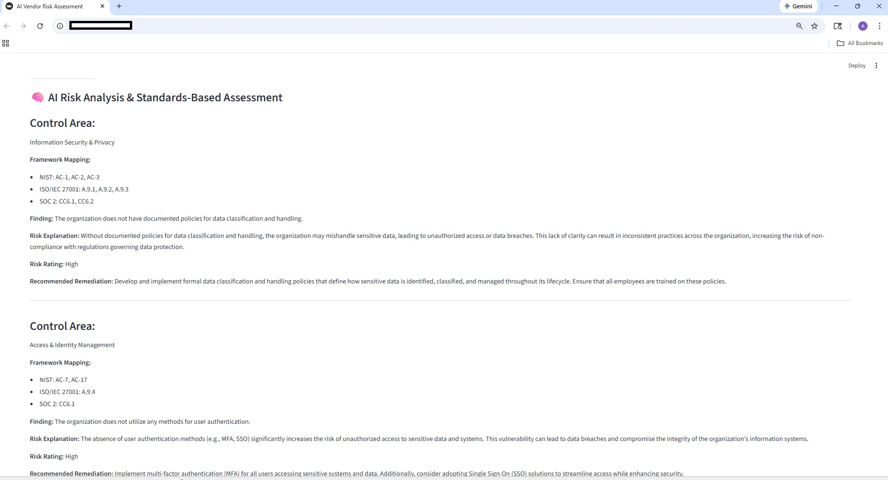
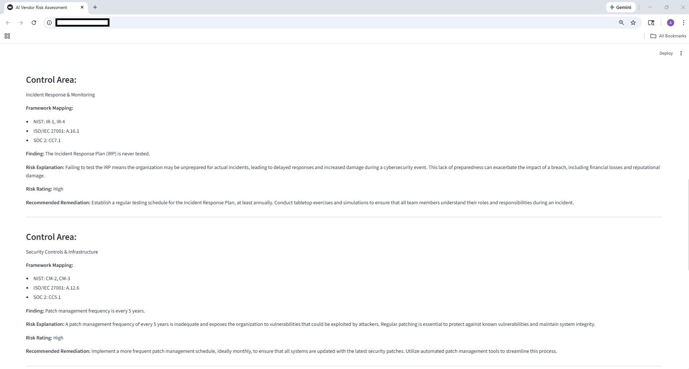
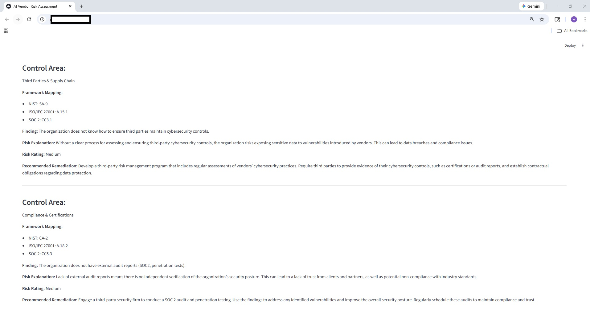

# AI Vendor Risk Assessment Assistant

This project is a Python-based tool that helps analyze third-party vendor security documents and identify potential risk areas using AI. It is designed to support vendor risk, GRC, and security teams during vendor reviews.

## Overview

This project simulates a real-world third-party risk management (TPRM) workflow by allowing users to upload vendor documents and receive an AI-generated security assessment aligned to common industry frameworks.

The application focuses on qualitative analysis, framework mapping, and actionable remediation guidance.

## Features

- Upload vendor documentation (PDF, Word, Excel, TXT)
- AI-driven security and compliance analysis
- Framework alignment:
  - NIST SP 800-53 / 800-92
  - ISO/IEC 27001
  - SOC 2 Trust Services Criteria
- Risk ratings per control area
- Automated remediation recommendations
- Streamlit-based user interface

## Tech Stack

- Python
- Streamlit
- OpenAI API
- pdfplumber
- python-docx
- pandas

## Why This Project

Traditional vendor risk assessments often rely on static questionnaires, which are time-consuming and require manual review to identify gaps or weaknesses. This project leverages large language models to quickly analyze vendor responses, highlight potential risks, and provide actionable remediation guidance, saving time and improving decision-making.

## Project Scope & Limitations

This project is designed as a proof of concept to demonstrate how AI can
augment qualitative vendor risk assessments. It focuses on identifying gaps or weaknesses control
interpretation, framework alignment, and actionable remediation
recommendations.


## Disclaimer

This tool is provided for educational and demonstration purposes only.  
AI-generated assessments are exploratory and may not always be accurate.  
They should not be used as the sole basis for security, compliance, or risk decisions. All outputs should still be reviewed for accuracy.


## Screenshots

### 1️⃣ Running the Code in PyCharm
Shows the app being executed in PyCharm’s terminal.



---

### 2️⃣ Upload Interface
The user-friendly Streamlit interface where vendor documents (PDF, Word, Excel, TXT) are uploaded.



---

### 3️⃣ Sample Vendor Questionnaire (Test Data)
Example of a test questionnaire file loaded into the app, showing the questions and responses used for analysis.



---

### 4️⃣ AI Risk Analysis Output
After the questionnaire is analyzed, the AI provides a risk assessment, framework mapping, and automated remediation recommendations.





## How to Run Locally

```bash
pip install -r requirements.txt
streamlit run app.py
